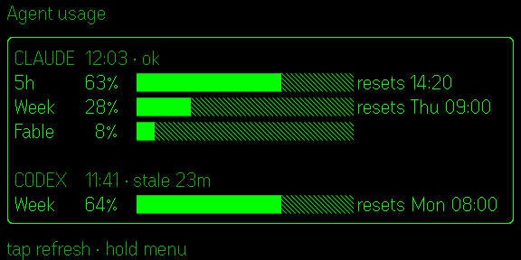
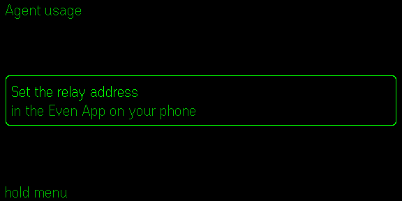
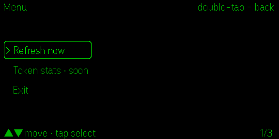
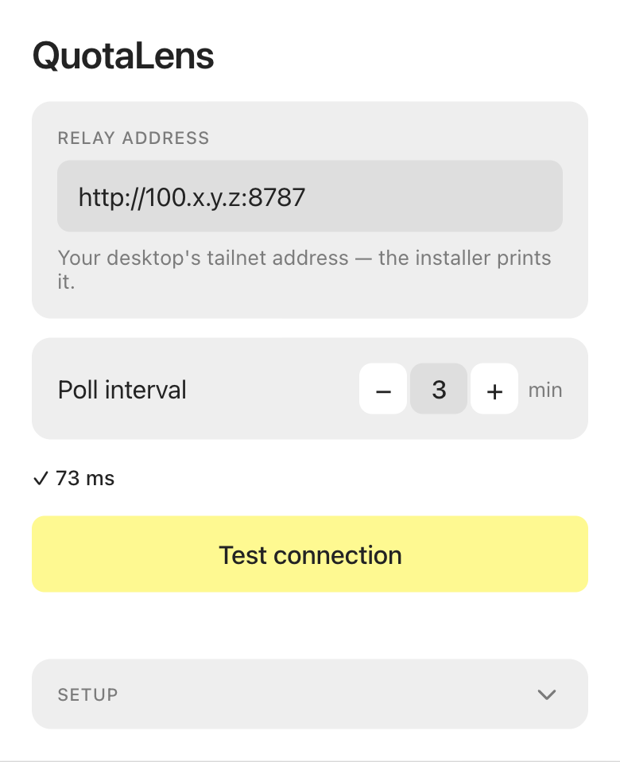

# QuotaLens

**English** · [繁體中文](README.zh-TW.md) · [简体中文](README.zh-CN.md)

QuotaLens shows Claude Code and Codex subscription usage on Even Realities G2 glasses. A self-hosted desktop daemon reads local usage sources, serves percentages and reset times over your [Tailscale](https://tailscale.com/) tailnet (a private WireGuard network between your own devices, free for personal use), and the Even Hub app renders them on the glasses with R1 ring or temple controls.

Open this repository in Claude Code or Codex and ask it to install QuotaLens or diagnose a connection or missing-source problem; `CLAUDE.md` and `AGENTS.md` provide the required runbooks and security rules.

## Architecture

```text
Desktop daemon ── HTTP inside Tailscale/WireGuard ──> Even App plugin ── BLE ──> G2 glasses
Claude + Codex                                              <── R1/temple input
```

The plugin polls `GET /usage.json`; the daemon listens on loopback and the desktop's Tailscale IPv4 address on port 8787.

## On the glasses

The usage page: one section per tool with the 5-hour and weekly windows, a bar, the reset time, and how fresh the numbers are (`ok` or `stale Xm`). The third Claude row is the per-model weekly limit when your plan has one.



First launch, before a relay address is set:



Long-press opens the menu (Refresh now / Exit):



Captures are from the Even Hub simulator at the G2's 576×288 resolution; the glasses render the same green-on-transparent layout.

## On the phone

QuotaLens has one settings page inside the Even App. Paste the relay address the desktop installer printed into **Relay address** (it accepts `100.x.y.z`, `100.x.y.z:8787` or the full `http://` origin and normalizes it), pick how often the glasses poll, and tap **Test connection** to confirm the phone can reach the daemon over Tailscale. Changes save immediately; there is no Save button.



Demo render of the settings page with a placeholder address; the `✓ <ms>` row is what a successful test looks like, not a measurement.

## Requirements

| Requirement | Supported setup |
|---|---|
| Glasses and phone | Even Realities G2 and Even App 2.2.10 or newer |
| Desktop OS | macOS (tested); Linux has an untested systemd user-unit template and manual setup |
| Node.js | 20.19+, 22.13+, or 24+ |
| Local tools | `jq` on the desktop; [Tailscale](https://tailscale.com/download) on both the desktop and the phone, signed in to the same tailnet |
| Usage sources | Claude Code and/or Codex CLI, signed in with a subscription account |

Using only Claude Code or only Codex is supported; the unavailable section is omitted.

## Install

On the desktop:

```bash
git clone https://github.com/dejavu79979/quotaLens.git quotaLens
cd quotaLens
bash scripts/install.sh
```

The macOS installer checks prerequisites, installs dependencies, records the desktop's tailnet IPv4, installs a per-user LaunchAgent, verifies the relay, and optionally wires the Claude Code status line. It prints a relay address such as `http://100.x.y.z:8787` when finished. Run `bash scripts/install.sh --dry-run` to inspect its actions without writing anything.

On the phone:

1. Keep Tailscale connected to the same tailnet as the desktop.
2. Install QuotaLens from the Even Hub store.
3. Open QuotaLens settings and paste the printed address into **Relay address**.
4. Tap **Test connection**. A `✓ <ms> ms` result means the app can reach the daemon.

See [docs/INSTALL.md](docs/INSTALL.md) for the complete setup and recovery instructions.

Until an address is set, the glasses show a short setup hint instead of a blank screen.

## Using an AI coding agent

The repository ships `CLAUDE.md` for Claude Code and `AGENTS.md` for Codex.
They provide install, verification, and debugging runbooks plus the security rules.
Open the repository in either tool and ask it to install QuotaLens on this machine.
You can also ask it to diagnose glasses stuck on `Connecting…` or reporting a `none` source.
The agent must follow those rules: credentials are read-only and must never be pasted anywhere.

## Controls on the glasses (R1 ring or temple)

| Gesture | Usage page | Menu |
|---|---|---|
| tap | refresh now | select |
| swipe up / down | one page only; the footer says so | move the cursor |
| long-press | open the menu (Refresh now / Token stats · soon / Exit) | — |
| double-tap | system exit dialog | back |

## Security boundary

- OAuth tokens are read from the Claude Code and Codex CLI credential stores on the desktop and transmitted only as HTTPS authorization headers to Anthropic's and OpenAI's own usage endpoints. They are never sent to the phone or the glasses, never included in relay responses, logs, or the repository, and QuotaLens never writes or refreshes them.
- The relay carries only the `UsagePayload` defined in `shared/schema.ts`: per-tool usage percentages and reset times, a fetched-at timestamp, an `ok` flag and a `source` label saying where the numbers came from, the remaining prepaid credits in USD when the provider reports them, the payload's `generatedAt` time, and the display name of the Claude model the weekly limit is scoped to. No account identifiers, session data or credentials.
- The tailnet is the only authentication layer. Every device in your tailnet can read the relay, so keep tailnet membership restricted.
- Security rule: never expose port 8787 with `tailscale funnel`. Without a separate secret, Funnel would make the usage endpoint public.

## Troubleshooting

| Symptom | Check |
|---|---|
| Test connection reports `net err` or `timeout` | Confirm Tailscale is connected on both devices and rerun `bash scripts/install.sh` |
| Test connection reports `HTTP 404` | Something answered at that address, but it is not the QuotaLens daemon: check the IP and whether another service holds port 8787 |
| `claude.source` or `codex.source` is `none` | Confirm that tool is installed and signed in, then inspect `~/Library/Logs/quotalens.log` |
| Glasses continue to show `Connecting…` | Test the relay on the phone and confirm the daemon's tailnet probe printed `200` |
| The app disappears after a Bluetooth reconnect | Reopen it with the Even App's send-to-glasses control |

## Self-packing fallback

Even's documentation describes a strict per-origin network whitelist, although Even App 2.2.10 has been observed not enforcing it for store-installed apps. If enforcement changes, build a package containing your own tailnet origin:

```bash
bash scripts/install.sh --self-pack
cd plugin
npm run build
npx evenhub pack app.json dist -o quotalens.ehpk --sdk-ver 0.0.15
```

Upload `plugin/quotalens.ehpk` in the Even Hub Developer Center and install that build. `--self-pack` intentionally modifies `plugin/app.json`; ordinary installs leave the checkout unchanged.

## License

[MIT](LICENSE) © 2026 dejavu79979. See the [privacy policy](docs/PRIVACY.md) for the Even Hub store disclosure.
