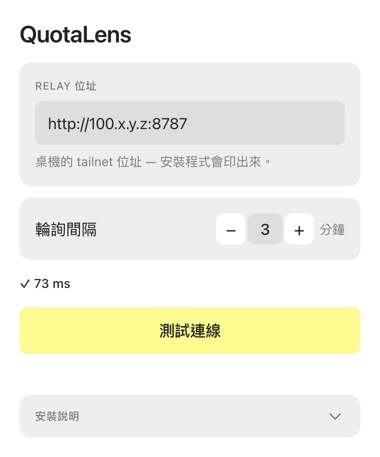

# QuotaLens

[English](README.md) · **繁體中文** · [简体中文](README.zh-CN.md)

QuotaLens 把 Claude Code 與 Codex 的訂閱用量顯示在 Even Realities G2 眼鏡上。一個自架的桌機 daemon 讀取本機的用量來源,透過你的 [Tailscale](https://tailscale.com/) tailnet(在你自己的裝置之間建立的私人 WireGuard 網路,個人使用免費)提供百分比與重置時間,再由 Even Hub app 把它們畫到眼鏡上,用 R1 戒指或鏡腳操作。

用 Claude Code 或 Codex 打開這個 repo,請它幫你安裝 QuotaLens,或診斷連線問題、用量來源缺失的問題;`CLAUDE.md` 與 `AGENTS.md` 提供必要的操作手冊與安全規則。

## 架構

```text
桌機 daemon ── Tailscale/WireGuard 內的 HTTP ──> Even App plugin ── BLE ──> G2 眼鏡
Claude + Codex                                                 <── R1 / 鏡腳輸入
```

plugin 輪詢 `GET /usage.json`;daemon 監聽 loopback 與桌機的 Tailscale IPv4 位址,port 8787。

## 眼鏡上的畫面

用量頁:每個工具一段,列出 5 小時視窗與每週限額、進度條、重置時間,以及數字有多新(`ok` 或 `過期 Xm`)。Claude 的第三列是方案有提供時的「單一模型每週限額」。眼鏡與設定頁的文字跟隨手機的系統語言(英文、繁體中文、簡體中文、日文、韓文、德文)。


首次啟動、尚未設定 relay address 時:


長按打開選單(立即重新整理 / 離開):


截圖取自 Even Hub simulator,解析度為 G2 的 576×288,韌體字型;眼鏡上呈現同樣的綠色透明版面。

## 手機上的畫面

QuotaLens 在 Even App 內只有一個設定頁。把桌機安裝程式印出的 relay address 貼進 **Relay address**(接受 `100.x.y.z`、`100.x.y.z:8787` 或完整的 `http://` origin,會自動正規化),選擇眼鏡的輪詢間隔,然後按 **Test connection** 確認手機能經由 Tailscale 連到 daemon。修改會立即儲存,沒有 Save 按鈕。



這是以佔位位址渲染的示意圖;`✓ <ms>` 那一列只是展示測試成功時的樣子,不是實測數值。

## 需求

| 項目 | 支援的環境 |
|---|---|
| 眼鏡與手機 | Even Realities G2 與 Even App 2.2.10 以上 |
| 桌機作業系統 | macOS(已測試);Linux 附有未測試的 systemd user unit 範本與手動安裝步驟 |
| Node.js | 20.19+、22.13+ 或 24+ |
| 本機工具 | 桌機需要 `jq`;桌機與手機都要安裝 [Tailscale](https://tailscale.com/download) 並登入同一個 tailnet |
| 用量來源 | Claude Code 和/或 Codex CLI,以訂閱帳號登入 |

只用 Claude Code 或只用 Codex 都可以;沒有的那一段不會顯示。

## 安裝

桌機端:

```bash
git clone https://github.com/dejavu79979/quotaLens.git quotaLens
cd quotaLens
bash scripts/install.sh
```

macOS 安裝程式會檢查前置條件、安裝相依套件、記錄桌機的 tailnet IPv4、安裝一個使用者層級的 LaunchAgent、驗證 relay,並可選擇性地接上 Claude Code 的 status line。完成時會印出類似 `http://100.x.y.z:8787` 的 relay address。執行 `bash scripts/install.sh --dry-run` 可以只檢視它會做什麼而不寫入任何東西。

手機端:

1. 讓 Tailscale 保持連線,並與桌機在同一個 tailnet。
2. 從 Even Hub 商店安裝 QuotaLens。
3. 打開 QuotaLens 設定,把印出的位址貼進 **Relay address**。
4. 按 **Test connection**。出現 `✓ <ms> ms` 表示 app 連得到 daemon。

完整的安裝與復原步驟見 [docs/INSTALL.md](docs/INSTALL.md)(英文)。

在位址設定好之前,眼鏡會顯示一段簡短的設定提示,而不是黑畫面。

## 用 AI coding agent 操作

這個 repo 附有給 Claude Code 的 `CLAUDE.md` 與給 Codex 的 `AGENTS.md`。
兩者提供安裝、驗證與除錯的操作手冊,以及安全規則。
用任一工具打開 repo,請它在這台機器上安裝 QuotaLens。
也可以請它診斷眼鏡卡在 `Connecting…` 或來源顯示 `none` 的問題。
agent 必須遵守那些規則:憑證只能讀取,絕不能貼到任何地方。

## 眼鏡操作(R1 戒指或鏡腳)

| 手勢 | 用量頁 | 選單 |
|---|---|---|
| 點一下(tap) | 立即重新整理 | 選取 |
| 上/下滑(swipe) | 只有一頁;footer 會提示 | 移動游標 |
| 長按(long-press) | 打開選單(立即重新整理 / Token 統計 · 即將推出 / 離開) | — |
| 點兩下(double-tap) | 系統的離開確認 | 返回 |

## 安全邊界

- OAuth token 從桌機上 Claude Code 與 Codex CLI 的憑證儲存區讀取,只會以 HTTPS authorization header 送往 Anthropic 與 OpenAI 自己的用量端點。它們絕不會送到手機或眼鏡,絕不會出現在 relay 回應、log 或這個 repo 裡,QuotaLens 也絕不寫入或刷新它們。
- relay 只承載 `shared/schema.ts` 定義的 `UsagePayload`:各工具的用量百分比與重置時間、取得時間戳、`ok` 旗標與說明數字來源的 `source` 標籤、供應商有回報時的剩餘預付額度(USD)、payload 的 `generatedAt` 時間,以及每週限額所對應的 Claude 模型顯示名稱。沒有帳號識別資料、session 資料或憑證。
- tailnet 是唯一的認證層。tailnet 內的每個裝置都讀得到 relay,所以請限制 tailnet 的成員。
- 安全規則:絕不用 `tailscale funnel` 把 port 8787 對外開放。沒有額外的 secret,Funnel 會讓用量端點變成公開的。

## 疑難排解

| 症狀 | 檢查 |
|---|---|
| Test connection 顯示 `net err` 或 `timeout` | 確認兩台裝置的 Tailscale 都已連線,然後重跑 `bash scripts/install.sh` |
| Test connection 顯示 `HTTP 404` | 那個位址有東西回應,但不是 QuotaLens daemon:檢查 IP,以及是否有別的服務佔用 port 8787 |
| `claude.source` 或 `codex.source` 是 `none` | 確認該工具已安裝並登入,然後查看 `~/Library/Logs/quotalens.log` |
| 眼鏡一直顯示 `Connecting…` | 在手機上測試 relay,並確認 daemon 的 tailnet 探測印出 `200` |
| 藍牙重新連線後 app 消失 | 用 Even App 的「送到眼鏡」功能重新打開 |

## 自行打包的備援

Even 的文件描述了嚴格的逐 origin 網路白名單,不過實測 Even App 2.2.10 對商店安裝的 app 並未強制執行。若日後開始強制,請自行打包一個含有你自己 tailnet origin 的版本:

```bash
bash scripts/install.sh --self-pack
cd plugin
npm run build
npx evenhub pack app.json dist -o quotalens.ehpk --sdk-ver 0.0.15
```

到 Even Hub Developer Center 上傳 `plugin/quotalens.ehpk` 並安裝該版本。`--self-pack` 會刻意修改 `plugin/app.json`;一般安裝不會動到 checkout。

## 授權

[MIT](LICENSE) © 2026 dejavu79979。Even Hub 商店的揭露事項見[隱私政策](docs/PRIVACY.md)(英文)。
